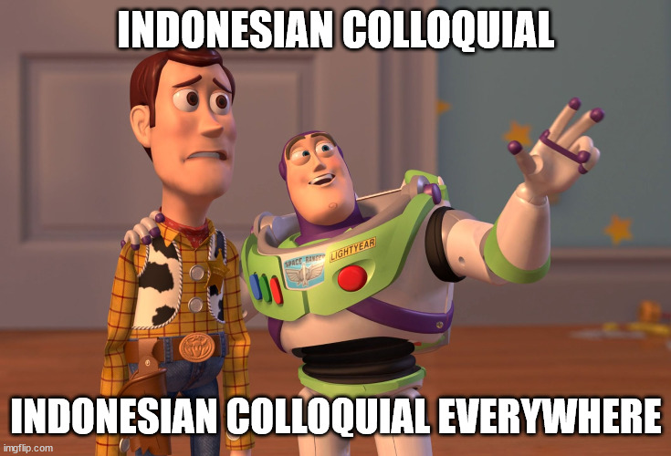

# IndoCollex

   
Welcome to our repository! This repository hosts the data on **"[IndoCollex: A Testbed for Morphological Transformation of Indonesian Word Colloquialism](https://aclanthology.org/2021.findings-acl.280.pdf)"** Research Paper published on ACL-IJCNLP 2021. We also provide the guideline on how we annotate the data.

## Repository Structure and Description

```
├───data
|   ├───full.csv
│   ├───formal_to_informal
│   ├───dict
│   └───informal_to_formal
└───guideline
```

1. `data/formal_to_informal` : Data to train our formal to informal system in the paper (contains train, dev, test)
2. `data/informal_to_formal` : Data to train our informal to formal system in the paper (contains train, dev, test)
3. `data/full.csv` : Full data that will be divided into `formal_to_informal` and `informal_to_formal` data. Some labels are also excluded.
3. `guideline`: PDF guideline how we annotate the data
5. `dict`: You can find formal-informal phrase level Indonesian dictionary (i.e. kamus alay), in tsv format.

## Indonesian Colloquial Transformation

We break down colloqual transformation into several categories as follow:

| Category           | Description                                                                                                 | Example                                                                |
|--------------------|-------------------------------------------------------------------------------------------------------------|------------------------------------------------------------------------|
| Disemvowelling     | elimination of some or all<br>the vowels                                                                    | kemarin - kmrn<br>belum - blum<br>besok - bsk<br>bagaimana - bgmn      |
| Affixation         | modification, addition<br>or removal of affixes                                                             | menyanyikan - nyanyiin<br>mengabari - ngabarin                         |
| Shortening         | shortening of the original word.                                                                            | sudah - dah<br>internet - inet<br>halusinasi - halu                    |
| Space/dash removal | Space and dash removal,<br>including collapsing repeated words.                                             | di rumah - dirumah<br><br>terima kasih - terimakasih<br>ibu-ibu - ibu2 |
| Sound alter        | slight change both in sound <br>and/or spelling in the text                                                    | pakai - pake<br>pahit - pait<br>aku - akuh                             |
| Acronym            | Syllabic and letter compounds of <br>one or more words akin to <br>acronyms, abbreviations, and portmanteau | ibu hamil - bumil<br>budak cinta - bucin<br>anak baru gede - abg       |
| Reverse            | Letter reversal, or colloquially<br>known as “Boso Walikan”                                                 | malang - ngalam<br>bang - ngab                                         |
| Loan words*        | borrowed words, often from<br>local language or English.                                                    | bapak - bokap                                                          |
| Jargon*            | tagline, terms that have been <br>made into a popular term                                                  | mana saya tahu - meneketehe                                            |

* We exclude these from our model data, but you can find them in the end-to-end formal-informal dictionary.


Some of Indonesian colloquial words are constructed by applying multiple transformation sequences, for example:
```
teman-teman -> teman2 -> temen2
bagaimana -> gimana -> gmn

```


## Paper Link and Citation

You can find our paper here: https://aclanthology.org/2021.findings-acl.280.pdf

If you use any of our work for your academic work, please cite:
```
@inproceedings{wibowo-etal-2021-indocollex,
    title = "{I}ndo{C}ollex: A Testbed for Morphological Transformation of {I}ndonesian Word Colloquialism",
    author = {Wibowo, Haryo Akbarianto  and Nityasya, Made Nindyatama  and Aky{\"u}rek, Afra Feyza  and Fitriany, Suci  and Aji, Alham Fikri  and Prasojo, Radityo Eko  and Wijaya, Derry Tanti},
    booktitle = "Findings of the Association for Computational Linguistics: ACL-IJCNLP 2021",
    month = aug,
    year = "2021",
    address = "Online",
    publisher = "Association for Computational Linguistics",
    url = "https://aclanthology.org/2021.findings-acl.280",
    doi = "10.18653/v1/2021.findings-acl.280",
    pages = "3170--3183",
}
```


## Team

1. Haryo Akbarianto Wibowo @ Kata.ai
2. Made Nindyatama Nityasya @ Kata.ai
3. ‪Afra Feyza Akyürek @ Boston University
4. Suci Fitriany @ Kata.ai
5. Alham Fikri Aji @ Kata.ai
6. Radityo Eko Prasojo @ Kata.ai & Universitas Indonesia
7. Derry Tanti Wijaya @ Boston University

